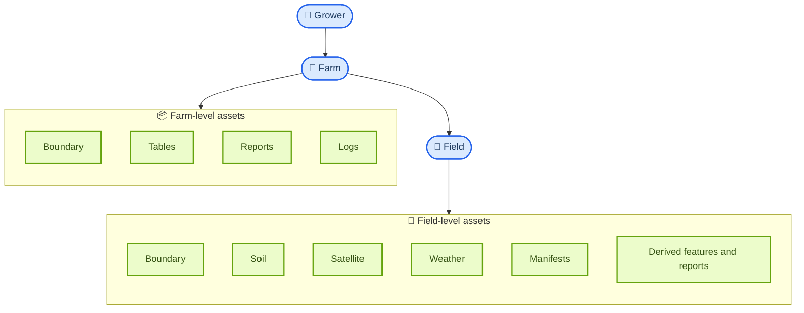
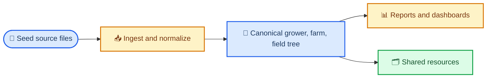
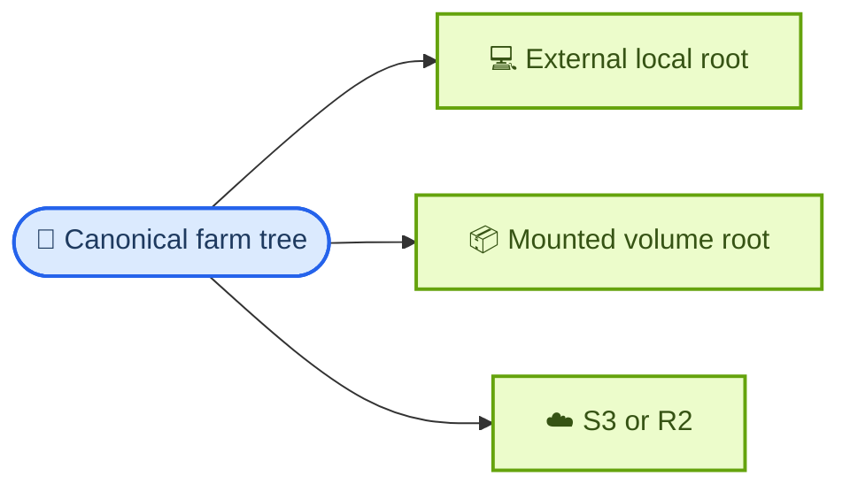
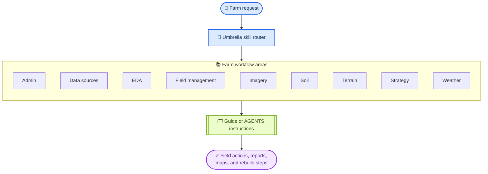
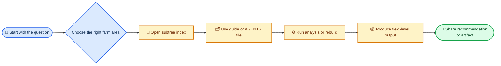
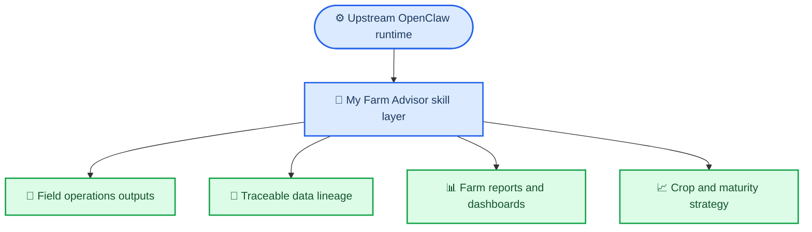

# My Farm Advisor

My Farm Advisor is the farm-specific skill umbrella for this repository. It turns the upstream OpenClaw runtime into an evidence-first agricultural system that can rebuild farm data, analyze field conditions, generate operator-ready reports, and route day-to-day questions into the right agronomic workflow.

Use this skill when the request is fundamentally about fields, crops, weather, soil, terrain, imagery, reporting, or strategy. It is the top-level router for the farm domain in this repo.

## What This Skill Does

- Routes farm questions into the right operational subtree instead of dumping everything into one giant prompt.
- Connects field operations, data rebuilds, imagery, soil, weather, and strategy work into one coherent system.
- Preserves a field-level source of truth so summaries and recommendations stay traceable.
- Provides both quick guidance docs and scoped agent instructions for repeatable farm workflows.
- Anchors the farm-specific skill layer that sits on top of upstream OpenClaw.

## Canonical Farm Data Structure

This skill is built around one deterministic storage model. The hierarchy is:

- `grower` - the customer or operating entity
- `farm` - a named operating unit inside a grower
- `field` - the atomic agronomic unit
- `asset` - the artifacts attached to a farm or field, such as boundaries, soil, satellite, weather, manifests, summaries, reports, and logs



The canonical on-disk shape is generated under the runtime base `${DATA_PIPELINE_DATA_ROOT}/data-pipeline`. `DATA_PIPELINE_DATA_ROOT` is required and must be an absolute writable path outside this repository.

```text
${DATA_PIPELINE_DATA_ROOT}/data-pipeline/
├── growers/
│   └── <grower_slug>/
│       ├── grower.json
│       ├── logs/
│       └── farms/
│           └── <farm_slug>/
│               ├── farm.json
│               ├── boundary/
│               ├── manifests/
│               ├── logs/
│               ├── derived/
│               │   ├── reports/
│               │   ├── summaries/
│               │   ├── dashboards/
│               │   └── tables/
│               └── fields/
│                   └── <field_slug>/
│                       ├── boundary/
│                       ├── soil/
│                       ├── weather/
│                       ├── satellite/
│                       ├── manifests/
│                       ├── derived/
│                       └── logs/
└── shared/
```

Representative metadata files are generated into the runtime data tree when the pipeline runs:

- grower metadata: `${DATA_PIPELINE_DATA_ROOT}/data-pipeline/growers/<grower_slug>/grower.json`
- farm metadata: `${DATA_PIPELINE_DATA_ROOT}/data-pipeline/growers/<grower_slug>/farms/<farm_slug>/farm.json`

## Deterministic Pipeline Entry Points

The farm skill is not just a loose set of guides. It also ships deterministic pipeline scripts that can rebuild or extend the canonical tree in a repeatable way.



High-value pipeline and bootstrap entrypoints include:

- full farm pipeline runner: [`data-pipeline/src/scripts/run_farm_pipeline.py`](data-pipeline/src/scripts/run_farm_pipeline.py)
- runtime bootstrap: [`data-pipeline/src/scripts/bootstrap_runtime.py`](data-pipeline/src/scripts/bootstrap_runtime.py)
- county bootstrap: [`data-pipeline/src/scripts/ingest/bootstrap_farm_from_county.py`](data-pipeline/src/scripts/ingest/bootstrap_farm_from_county.py)
- field download: [`data-pipeline/src/scripts/ingest/download_fields.py`](data-pipeline/src/scripts/ingest/download_fields.py)
- weather download: [`data-pipeline/src/scripts/ingest/download_weather.py`](data-pipeline/src/scripts/ingest/download_weather.py)
- soil download: [`data-pipeline/src/scripts/ingest/download_soil.py`](data-pipeline/src/scripts/ingest/download_soil.py)
- satellite download: [`data-pipeline/src/scripts/ingest/download_satellite_imagery.py`](data-pipeline/src/scripts/ingest/download_satellite_imagery.py)
- reporting bootstrap: [`data-pipeline/src/scripts/reporting_bootstrap.py`](data-pipeline/src/scripts/reporting_bootstrap.py)
- farm markdown/html outputs: [`data-pipeline/src/scripts/reporting/generate_farm_markdown.py`](data-pipeline/src/scripts/reporting/generate_farm_markdown.py), [`data-pipeline/src/scripts/reporting/generate_farm_html.py`](data-pipeline/src/scripts/reporting/generate_farm_html.py)
- field posters: [`data-pipeline/src/scripts/reporting/generate_field_posters.py`](data-pipeline/src/scripts/reporting/generate_field_posters.py)

The most important high-level orchestration docs are:

- deterministic rebuild contract: [`data-sources/farm-data-rebuild/AGENTS.md`](data-sources/farm-data-rebuild/AGENTS.md)
- farm reporting pipeline: [`data-sources/farm-intelligence-reporting/AGENTS.md`](data-sources/farm-intelligence-reporting/AGENTS.md)
- runtime data-pipeline bootstrap behavior: [`data-pipeline/AGENTS.md`](data-pipeline/AGENTS.md)

## Shared Resources

The farm tree includes a `shared/` layer for reusable datasets that are not specific to one field or one farm.

Committed metadata examples already included in the skill tree:

- geoadmin layers under [`data-pipeline/src/shared/geoadmin/`](data-pipeline/src/shared/geoadmin)
- corn maturity baselines under [`data-pipeline/src/shared/corn_maturity/`](data-pipeline/src/shared/corn_maturity)
- soybean maturity baselines under [`data-pipeline/src/shared/soybean_maturity/`](data-pipeline/src/shared/soybean_maturity)
- shared manifest examples under [`data-pipeline/src/shared/manifests/`](data-pipeline/src/shared/manifests)

These shared resources support deterministic rebuilds and reporting without forcing every grower or farm to duplicate the same baseline datasets.

The committed `data-pipeline/src/shared/...` files are metadata, source records, or tiny manifests only. Generated shared payloads are rebuilt under `${DATA_PIPELINE_DATA_ROOT}/data-pipeline/shared/...`; do not treat checkout-local `src/shared` paths as generated data destinations.

Geoadmin payloads are handled a little differently from most small reference files: the committed items under `data-pipeline/src/shared/geoadmin/` are metadata records plus downloader code, while the generated GeoJSON/Parquet payloads are rebuilt at runtime under `${DATA_PIPELINE_DATA_ROOT}/data-pipeline/shared/geoadmin/{l0_countries,l1_states,l2_counties}/`. See [`docs/GEODATA.md`](docs/GEODATA.md) for the metadata locations, source URL conventions, runtime destinations, and downloader commands.

## Storage Modes

The same farm data model can run against any explicit external runtime root.



The shipped pipeline/runtime docs require:

- `DATA_PIPELINE_DATA_ROOT` set to an absolute writable path outside the checkout.
- runtime base `${DATA_PIPELINE_DATA_ROOT}/data-pipeline`.
- runtime source copy `${DATA_PIPELINE_DATA_ROOT}/data-pipeline/src`; pipeline commands run from this copy, not from checkout `src/`.
- default runtime venv `${DATA_PIPELINE_DATA_ROOT}/data-pipeline/.venv`, unless `DATA_PIPELINE_VENV_DIR` points to another absolute venv path.
- generated outputs under runtime-base children such as `growers/`, `shared/`, reports, logs, and manifests.

The installer in [`data-pipeline/README.md`](data-pipeline/README.md) does not choose a fallback root. A safe first run looks like this:

```bash
export DATA_PIPELINE_DATA_ROOT=/absolute/path/to/my-farm-advisor-runtime
cd my-farm-advisor/data-pipeline
./scripts/install.sh
cd "${DATA_PIPELINE_DATA_ROOT}/data-pipeline/src"
"${DATA_PIPELINE_DATA_ROOT}/data-pipeline/.venv/bin/python" \
  scripts/run_farm_pipeline.py --structure-test
```

User-level persistence uses `${XDG_CONFIG_HOME:-$HOME/.config}/environment.d/60-my-farm-advisor.conf` for future sessions only. It does not change the current shell, so command examples still export `DATA_PIPELINE_DATA_ROOT` before running the installer or runtime scripts.

## How It Runs



The umbrella entrypoint is [`SKILL.md`](SKILL.md). From there, the skill routes into one of the subtree indexes, and then into the actual guide or AGENTS file that does the work.

## Core Capability Areas

| Area             | What it covers                                                         | Start here                                               |
| ---------------- | ---------------------------------------------------------------------- | -------------------------------------------------------- |
| Admin            | Geospatial administration and interactive map workflows                | [`admin/INDEX.md`](admin/INDEX.md)                       |
| Data Sources     | Canonical rebuilds, data pipelines, and farm intelligence reporting    | [`data-sources/INDEX.md`](data-sources/INDEX.md)         |
| EDA              | Exploratory analysis, comparisons, correlations, and time-series views | [`eda/INDEX.md`](eda/INDEX.md)                           |
| Field Management | Boundaries, field sampling, and headlands workflows                    | [`field-management/INDEX.md`](field-management/INDEX.md) |
| Imagery          | Landsat and Sentinel-2 workflows for vegetation and scene analysis     | [`imagery/INDEX.md`](imagery/INDEX.md)                   |
| Soil             | SSURGO, poster-card outputs, and CDL-based soil/crop context           | [`soil/INDEX.md`](soil/INDEX.md)                         |
| Terrain          | DEM source policy, elevation provenance, and terrain derivatives       | [`terrain/INDEX.md`](terrain/INDEX.md)                   |
| Strategy         | Crop strategy and maturity planning workflows                          | [`strategy/INDEX.md`](strategy/INDEX.md)                 |
| Weather          | NASA POWER weather ingestion and downstream weather analysis           | [`weather/INDEX.md`](weather/INDEX.md)                   |

## Typical Workflow



Examples:

- "Rebuild the farm from source systems" -> [`data-sources/farm-data-rebuild/AGENTS.md`](data-sources/farm-data-rebuild/AGENTS.md)
- "Generate field boundaries or map views" -> [`field-management/field-boundaries/GUIDE.md`](field-management/field-boundaries/GUIDE.md)
- "Check weather and maturity planning" -> [`weather/INDEX.md`](weather/INDEX.md) and [`strategy/INDEX.md`](strategy/INDEX.md)
- "Prepare a farm intelligence report" -> [`data-sources/farm-intelligence-reporting/AGENTS.md`](data-sources/farm-intelligence-reporting/AGENTS.md)

## Why It Matters In This Repo



This skill is the main farm-specific intelligence layer. The rest of the repository gives you runtime, channels, gateway behavior, and deployment. This skill tells the system how to think and work like a farm advisor.

## Important Entry Points

- Umbrella router: [`SKILL.md`](SKILL.md)
- Top-level navigation: [`INDEX.md`](INDEX.md)
- Farm data rebuild: [`data-sources/farm-data-rebuild/AGENTS.md`](data-sources/farm-data-rebuild/AGENTS.md)
- Farm reporting: [`data-sources/farm-intelligence-reporting/AGENTS.md`](data-sources/farm-intelligence-reporting/AGENTS.md)
- Field boundaries: [`field-management/field-boundaries/GUIDE.md`](field-management/field-boundaries/GUIDE.md)
- SSURGO workflows: [`soil/ssurgo-soil/GUIDE.md`](soil/ssurgo-soil/GUIDE.md)
- DEM terrain workflows: [`terrain/dem-terrain/SKILL.md`](terrain/dem-terrain/SKILL.md)
- Sentinel-2 workflows: [`imagery/sentinel2-imagery/GUIDE.md`](imagery/sentinel2-imagery/GUIDE.md)
- Weather workflows: [`weather/nasa-power-weather/GUIDE.md`](weather/nasa-power-weather/GUIDE.md)

## Data and Runtime Notes

- This skill suite ships large supporting examples and shared data assets.
- The deterministic scripts and data-tree helpers are part of the skill, not just external repo utilities.
- Canonical path helpers live in [`data-pipeline/src/scripts/lib/paths.py`](data-pipeline/src/scripts/lib/paths.py).
- Some workflows assume pulled large files or generated artifacts are available under `${DATA_PIPELINE_DATA_ROOT}/data-pipeline`.
- The nested subtree documents are the real operating surface; this README is the map, not the full manual.

## Quick Start

1. Start with [`SKILL.md`](SKILL.md).
2. Open the matching area in [`INDEX.md`](INDEX.md).
3. Follow the linked `GUIDE.md` or `AGENTS.md`.
4. Keep outputs tied back to fields, source data, and reproducible methods.
